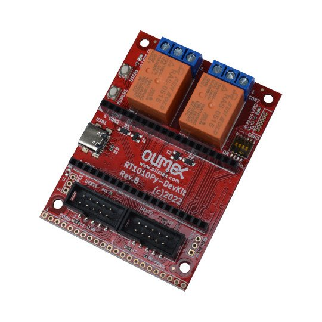

# RT1010Py-DevKit
Development board for RT1010Py board

https://www.olimex.com/Products/MicroPython/RT1010Py-DevKit/open-source-hardware

Features:

* RT1010Py socket connector
* Two UEXT connectors
* Two Relays 10A/250VAC
* USB-C power supply
* Two buttons
* Boot configuration slide switch
* Dimensions: (55 x 75)mm ~ (2.17 x 2.95)"

## Licenses

* Hardware is released under CERN Open Hardware Licence Version 2 - Strongly Reciprocal, all silkscreen credits to Olimex should remain;
* Software is released under GPL3 Licensee
* Documentation is released under CC BY-SA 4.0
